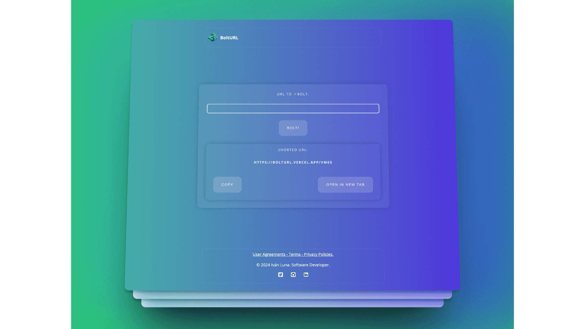

## Welcome to the [Bolt URL!](https://bolturl.site/) Project.
This Link Shortener web app showcases how Python can do anything. Using Python (Flask Framework) with Templates and a little of style. For detailed insights, please visit [this link](https://ivanluna.dev/projects/post-python-bolturl/).

### Demo

Visit the live app: [bolturl.site](https://bolturl.site)

### Preview




### Key Features:
-**Link Shortening:**
    -Allows users to shorten long URLs, creating more concise links.
    -Utilizes Python for efficient link shortening functionality.

-**Python and Flask Usage:**
    -Demonstrates the capabilities of Python, specifically utilizing the Flask framework.
    -Leverages Python for backend functionalities, showcasing its versatility in web development.

-**User-Friendly Interface:**
    -Provides a user-friendly interface for an intuitive user experience.
    -Incorporates templates and styling to enhance the visual appeal of the web app.
   
### Prerequisites:
[**Python 3.11**](https://www.python.org/downloads/release/python-3110/)

### Installation and Local Execution

#### 1. Clone this project.
```bash
git clone https://github.com/imprvhub/bolturl-python.git
```
#### 2.1 Navigate to the project directory (from your terminal IDE)
```bash
cd /your/folder/directory/bolturl-python
```
#### 3. Install Dependencies
```bash
pip install -r requirements.txt
```
#### 4. Create your own database (This is Planetscale [MYSQL] approach) and replace the following enviroment variables in order to get fully functionality of the app in local production.
```bash
domain_url = os.getenv("DOMAIN_URL", "https://localhost:5000")
hashids_salt = os.getenv("HASHIDS_SALT")
hashids = Hashids(salt=hashids_salt, min_length=4)  
connection = pymysql.connect(
        host=os.getenv("DATABASE_HOST"),
        user=os.getenv("DATABASE_USERNAME"),
        passwd=os.getenv("DATABASE_PASSWORD"),
        db=os.getenv("DATABASE"),
        ssl={"ssl_accept": "strict"}
    )
```
#### 5. Run with the following command in your terminal IDE.
```bash
python3 index.py
```

### Conclusion:

#### Achievements

- **Successful bypassed CORS restricted resources :** Sometimes, when specific tasks are carried out between servers, the CORS mechanism restricts certain operations, it happened to me in this project when I was trying to redirect to 'shortened' links.

#### Learnings

- **No Frontend Framework:** In this project I learned that sometimes it is not necessary to depend on other front end frameworks. 


### Feedback & Support
Your input matters, and I'm ready to help address any inquiries or feedback you may have. Your contributions are essential for refining the project and enhancing the overall user experience. Don't hesitate to get in touch with me:

Feel free to share your insights, recommendations, or suggestions for continuous improvement. If you encounter any challenges or require assistance, please [create a new GitHub issue](https://github.com/imprvhub/bolturl-python/issues/new). Be sure to provide a detailed description of your issue to facilitate prompt and precise support.

### License
For more information regarding this topic please read the following [User Agreement Section.](https://ivanluna.dev/user-agreement/)